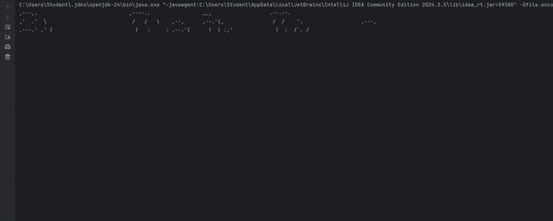

# Bay City Subs

This application is a custom sandwich shop that uses a in depth muti tiered user interface
Customers can build fully custom sandwiches, add drinks & chips, and checkout.  
Each order generates a neatly formatted, timestamped receipt.

---

##  Features

- **Home Screen** with options to start a new order or exit  
- **Order Menu**  
  - Add Sandwich (size, bread, toast, meats, cheeses, veggies, sauces)  
  - Add Drink (size & flavor)  
  - Add Chips (flavor)  
  - Checkout & confirm order
- **ASCII Art Animation** at startup
- and it is the best animation youve ever seen.
- **Receipt Writer**  
  - Prints store name, address, phone, date/time  
  - Lists each item and total  
  - Auto-generates a bordered, timestamped `.txt` file under `receipts/`

---

## Animation Preview

## Screenshots

Sandwich order screen

<img src="./Assets/
