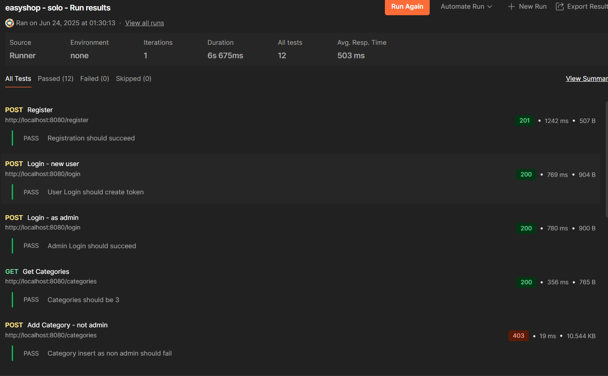
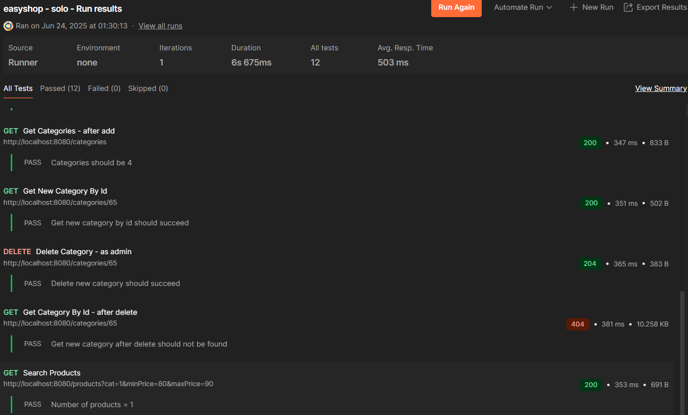

# E-commerceAPI EASYSHOP

## Overview

**E-commerceAPI EASYSHOP** is a Java-based Spring Boot backend for a full-featured e-commerce platform. It supports user registration and login, shopping cart management, order checkout, product browsing, and admin-level product control. The backend connects to a SQL Server database and follows a layered architecture using DAO classes and models.

This capstone project demonstrates:

- RESTful API development
- Role-based access control 
- Secure authentication using JWT tokens
- SQL Server database integration using JDBC
- Structured controller-service-dao architecture

---

## Key Features

- User registration and login
- Secure JWT authentication
- Admin-only product creation, update, and deletion
- Product browsing for all users
- Add to cart, update quantity, remove from cart
- Checkout flow (creates order and order line items)
- View and update user profile

---

## How to Run the Project

To run the EasyShop backend locally:

1. Clone the repo and open it in your IDE  
2. Set up your database connection in `application.properties`  
3. Run the application using your IDE or `./mvnw spring-boot:run`  
4. Test endpoints at `http://localhost:8080/api` using Postman or a browser

That's it! 🎉 Your backend should now be running locally.

---

## Screenshots

Below are two screenshots from my postman test scrpits 





---

## Interesting Code Snippet

This method inside the `ShoppingCartController` class, This method handles adding a product to the logged-in user's shopping cart. It uses the product's ID from the URL and the authenticated user's information to ensure the correct cart is updated. After adding the product, the updated cart is returned to keep the front-end in sync.

```java

 @PostMapping("/products/{productId}")
    public ShoppingCart addProduct(@PathVariable int productId, Principal principal)
    {
        try
        {
            String userName = principal.getName();
            User user = userDao.getByUserName(userName);
            int userId = user.getId();

            shoppingCartDao.addProduct(userId, productId);
            return shoppingCartDao.getByUserId(user.getId());

        }
        catch (Exception e)
        {
            throw new ResponseStatusException(HttpStatus.INTERNAL_SERVER_ERROR, "Unable to add product to cart.");
        }
    }


```


