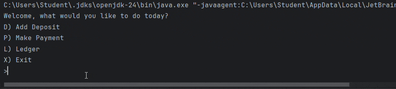
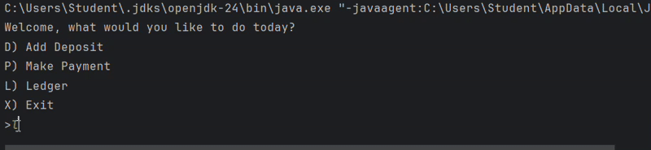
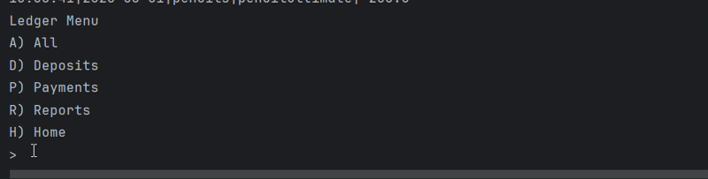

Java CLI Ledger Tracker

This project is a personal finance and business transaction manager built entirely in Java called LedgerCLI. This command-line interface (CLI) application allows users to manage deposits, payments, and generate real-time transaction reports continuously being saved in a CSV file.

-------->

## Project Description

This project is designed as a lightweight financial record-keeping tool. 

-> Adds deposits and payments 
-> View the full ledger including filtered views 
-> Runs useful financial reports (e.g., month-to-date, vendor search)
-> Records data in a CSV file for continued use.

-------->

## Screenshots







-------->

## Code Highlight

The application allows users to search past transactions by vendor name through the **Reports Menu**.

This feature reads all transactions from the `Transactions.csv` file and lets the user enter a search term to filter matching vendors.

Example Output

```java
public void searchByVendor() {
    Scanner scanner = new Scanner(System.in);
    System.out.print("Enter vendor name to search: ");
    String vendorSearch = scanner.nextLine().trim().toLowerCase();

    for (Transactions tx : transactionsList) {
        if (tx.getVendor().toLowerCase().contains(vendorSearch)) {
            tx.displayTransaction();
        }
    }
}
```

-------->

### How to Run the Application 

#### ✅ Prerequisites
- IntelliJ IDEA (Community edition is completely fine)
- Java JDK 17 or later installed

-------->

#### Steps to Run:

1. Clone or Download the Repository
   - **Option A:**  
     If using Git:
     ```bash
     git clone https://github.com/your-username/your-repo-name.git
     ```
   - **Option B:**  
     Download the `.zip` and extract it manually.

2. Open the Project in IntelliJ
  
3. Run the Application
   - In the **Project pane**, open `Main.java` (located in `src/main/java/org/example/`).
   - Right-click anywhere in the `Main` class and choose **Run 'Main.main()'**.

4. The application will start in the IntelliJ terminal. Use the menu options to interact with the ledger.


Make sure `transactions.csv` exists in your project root.

---

## Contact
GitHub: Fcannsekai  

---
